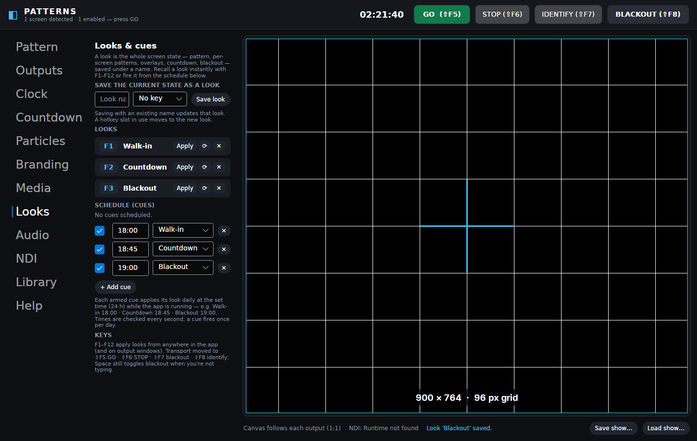

<p align="center">
  
</p>

<h1 align="center">Patterns</h1>

<p align="center">
  <b>Portable Windows test-pattern suite for corporate events, shows and festivals.</b><br/>
  LED walls · video walls · blended projection · multi-screen · countdowns · branding · NDI®
</p>

---

<p align="center">
  
</p>

**Patterns** is a single portable `Patterns.exe` you keep on a USB stick. It opens instantly on
any Windows 10/11 x64 machine — no install, no admin rights, no registry — and puts accurate,
pixel-exact test patterns on every screen, wall and NDI receiver in the room. It is built to run
for hours without a hiccup: GPU-accelerated rendering, zero-allocation draw loops, per-frame
fault containment, and settings that can never brick startup.

## What it does

- **A graphical screen overview** — every detected screen is a live tile showing exactly what
  it outputs. Drag screens flush together and they join into one spanned canvas (seam-tested,
  viewport-exact); drag them apart and they split again. Any screen can be enabled/disabled or
  given its own pattern — and your main screen stays off by default when other outputs exist,
  so GO never covers the controls.
- **LED wall mode** — describe the wall the way LED techs do: panel pixel size (any custom size,
  presets for 64–256 px), then either columns × rows or a target canvas (edge panels go partial,
  like the real thing). Tile borders, row-column / linear / serpentine data-run numbering,
  pixel grid, center cross, dimension readouts. **Irregular walls too**: switch to the map
  editor and drag mixed-size panels, offset blocks and gaps into place (they snap flush) —
  or seed the map from the grid and edit the exceptions.
- **Video wall mode** — standard-resolution display elements (landscape or portrait), any grid,
  bezel-loss hatching, per-element numbering, diagonals and center circles.
- **Projection blend mode** — 2–12 projectors in a row or column, native resolution and overlap
  in pixels, continuous alignment grid through the zones, hue-coded projector frames, blend-curve
  ramps (linear / cosine / S-curve / gamma 2.2), zone markers with centerlines, and a flat 50%
  grey double-stack check.
- **A proper pattern library** — alignment grids, SMPTE RP 219-style / EBU / 75% / 100% bars
  (legal or full range), grey & RGB ramps, banding steps, focus charts (Siemens star, line pairs,
  type), geometry & safe areas, flat fields, 1-px checkerboards — parametric at any resolution up
  to 4K DCI and beyond, with a thumbnail preset gallery plus your own saved presets.
- **Motion diagnostics** — moving bar with a px-per-frame judder mode, bouncing FPS box,
  frame-flash drop detector, animated zone plate, scrolling grid.
- **Particle mini-studio** — snow, confetti, starfield, rain, bokeh, embers, fireflies presets;
  emitter, physics, shapes (including your logo as a sprite), brand palettes, additive glow —
  thousands of particles, one draw call.
- **Time, date & countdowns** — clock overlay (12/24 h, seconds, date) and a show countdown to a
  time of day or a duration (“BACK FROM LUNCH AT…”, “SHOW STARTS IN…”), with hold / flash /
  message endings and an optional progress bar. Overlays composite over *any* pattern.
- **Corporate branding** — brand kit (primary/secondary/accent/background/text + logo) that
  drives accents, checkerboards, colour cycles, particles and overlay text. Measurement lines
  stay neutral so patterns remain accurate. Kits save/load per client.
- **User media & playlists** — your images (PNG/JPEG/BMP/WebP) with fit modes; your videos
  *and audio files* (MP3/WAV/FLAC…) via libVLC (bundled in the *full* download, optional
  otherwise), with live mute and volume that never restart the media. Everything you load
  lands in the Library under *My media* for one-click recall — and the **playlist** source
  cycles files and whole folders (rescanned live): drag rows to re-order or use seeded
  shuffle, images on a dwell timer, videos/audio to their end, a ▶ NOW marker on the
  playing row, per-item overrides and daily *play at HH:mm for N seconds* scheduling.
  Media renders through the engine, so it reaches spans and NDI too.
- **Live inputs** — receive an **NDI® feed** off the network (sources auto-discovered), or an
  **HDMI/SDI capture device** (Elgato, Magewell, Blackmagic WDM, AVerMedia, webcams — anything
  DirectShow) — both composite through the engine like any pattern, so a camera or remote feed
  reaches spans, trims and NDI outputs.
- **Web pages on screens** — open a session schedule, dashboard or stream full screen (kiosk)
  or windowed on any chosen screen, as managed Edge/Chrome windows with a private profile:
  they never touch the operator's browser and close from the app with one click, with a
  saved-pages list for quick recall.
- **Looks & cues** — save the entire content state (pattern, per-screen patterns, overlays,
  countdown, blackout) as a named look on `F1`–`F12`, then run the evening from a simple
  schedule: *Walk-in 18:00 · Countdown 18:45 · Blackout 19:00*. Screen arrangement and NDI
  infrastructure deliberately stay put when a look recalls.
- **Portrait & mismatched house displays** — per-screen output rotation (90°/180°/270°,
  content stays upright, the overview shows the rotated footprint) plus per-screen
  brightness / gamma / RGB trims as exact 256-entry LUTs — match that one warm hotel plasma
  without touching the rest of the rig.
- **Soundcheck audio** — a click-free tone generator (20 Hz–20 kHz, dBFS level) and a channel
  ident (one pip LEFT, two pips RIGHT) with a matching on-screen indicator on every output,
  so front-of-house can confirm routing at a glance. Never auto-starts with the app.
- **Ticker data feeds** — point the message ticker at an RSS/Atom feed, a CSV/text file of
  lines, or an ICS calendar (next 24 h as `HH:mm Event`) — session schedules and wayfinding
  straight onto the screens, refreshed on your interval.
- **System fonts** — overlay text (clock, countdown, messages, chips) in any font installed
  on the machine, with the bundled Inter as a travelling fallback.
- **NDI® outputs** — any number of senders, each with its own name, resolution, frame rate,
  source (program or a specific screen) and bit depth — including **10-bit P216** with a
  BT.709 limited-range pipeline for serious ramp/banding checks. Feature-detected at runtime
  (nothing crashes without the NDI runtime).
- **A Show page** — once the rig is built, run the evening from one screen: GO/STOP/BLACKOUT,
  presenter next/back, every look as a big button, the audio track, and live status. The
  other tabs stay out of the way.
- **Remote control** — a **web remote** (big-button page for any phone/tablet on the network),
  a one-command-per-line **TCP protocol** with live state feedback, and a ready-made
  **Bitfocus Companion module** (`integrations/companion-module-patterns/`) with presets for
  transport, looks `F1`–`F12`, individual screens and screen groups, presenter steps and
  audio — plus feedbacks and variables for Stream Deck keys. See [`docs/REMOTE.md`](docs/REMOTE.md).
- **Presenter click-through** — programme looks in a click order and hand the presenter a
  USB clicker: `Page Down` advances, `Page Up` goes back (exactly what presentation remotes
  send), and each click can change any screen's content — patterns, media, blackout, the lot.
  The remote and Companion `NEXT`/`PREV` drive the same steps.
- **Crossfade transitions** — content changes glide instead of cut (100 ms–3 s, engine-level,
  so they work on spans, rotated outputs and NDI alike — even between videos and live inputs).
  Turn them off and everything cuts clean like a test-pattern box should.
- **Picture-in-picture** — a second live input (another NDI feed or a capture device) as a
  corner overlay over the program on every output: anchor, size, opacity and border are live.
  Confidence-monitor the camera while the walls show content.
- **Independent audio track** — play a music/VO file to **any set of audio outputs** (front
  of house, a Dante/USB interface, HDMI screen audio — several at once), with loop and live
  volume, regardless of what's on screen. Video sound and the tone generator stay separate.
- **4-corner warp** — nudge each output's corners (keystone/skew) so a slightly-off projector
  lands straight on the surface — composed with rotation and per-screen trims, applied to
  patterns, media and live inputs alike.
- **Stingers** — one-press sounds and clips, no audio engineer needed: *"Take your seats,
  the show is about to begin."* A sound plays over everything on the audio-track outputs
  while the music ducks underneath (and comes back by itself); a **video clip takes over
  every screen and the previous content returns the moment it ends** — unless the operator
  changes content mid-clip, in which case their choice stands. Fired from the Show page,
  the web remote, the TCP protocol or Companion.
- **A watchdog that keeps the show up** — the app runs supervised: a crash, or a UI that
  stops responding for 30 s, gets the app restarted within seconds **with the same setup —
  outputs re-opened and the audio track resumed** (a sidecar file remembers what was live;
  a clean close never auto-restores). Restarts back off and stop if something genuinely
  crash-loops. Individual render faults never get that far: they're contained per frame and
  counted on a health line (uptime · restarts · faults caught) on the Show page and remotes.

<table>
  <tr>
    <td></td>
    <td></td>
  </tr>
  <tr>
    <td></td>
    <td></td>
  </tr>
  <tr>
    <td></td>
    <td></td>
  </tr>
  <tr>
    <td></td>
    <td></td>
  </tr>
</table>

*Patterns rendered by the engine exactly as outputs and NDI receive them; the irregular-map
editor, looks/cues/presenter steps and the Show page drive them live.*

## Quick start

1. Grab `Patterns.exe` (build it with `build/publish-win-x64.cmd`, or take the CI artifact) and
   put it in a folder you can write to (USB stick, desktop — anywhere).
2. Run it. Arrange your screens on the **Outputs** page — drag them together for one big
   canvas, click a tile to enable/disable it or give it its own pattern.
3. Choose a pattern (or click one in the **Library**), tune it, press **GO** (`Shift+F5`).
4. Everything — wall geometry, blend overlap, colours, countdowns — updates live on the outputs.
5. Save the state as a **look** and put it on an F-key or the daily cue schedule (**Looks** tab).
6. Run the evening from the **Show** tab — or from a phone, tablet or Stream Deck via the
   **Remote** tab (web remote, TCP protocol, Bitfocus Companion module).

| Key | Action |
|---|---|
| `F1`–`F12` | apply saved looks |
| `Shift+F5` | GO — open outputs |
| `Shift+F6` | STOP — close outputs |
| `Shift+F7` | IDENTIFY — flash screen numbers |
| `Shift+F8` / `Space` | BLACKOUT toggle |
| `Page Down` / `Page Up` | presenter click-through next / back (when armed) |
| on outputs: `Esc` | close outputs |
| on outputs: `Space` / `B`, `I`, `F1`–`F12`, `Page Down`/`Up` | blackout, identify, looks, presenter |

Settings autosave beside the exe (`patterns.settings.json`, atomic with backup); whole rigs save
as show files (`*.patshow.json`). Presets and brand kits are plain JSON folders next to the exe.

## Optional integrations

- **NDI**: install the free [NDI runtime](https://ndi.video) *or* drop
  `Processing.NDI.Lib.x64.dll` next to `Patterns.exe`. The NDI tab shows what was detected.
- **Video**: use the **full** build (`Patterns-portable-win-x64-full` CI artifact or
  `build\publish-win-x64-full.cmd`), which bundles libVLC — or with the lean exe, install
  64-bit [VLC](https://videolan.org) / place a `libvlc` folder next to `Patterns.exe`.
  Images work without any of this.
- **Remote control**: switch it on in the **Remote** tab — the web remote and TCP protocol
  need nothing installed anywhere. For Stream Decks, load the Companion module from
  `integrations/companion-module-patterns/` (or use Companion's Generic TCP with the
  commands in [`docs/REMOTE.md`](docs/REMOTE.md)). *No password — anyone on the network can
  drive the show while it's enabled, so switch it off when you don't need it.*

## Building

```bash
dotnet test                      # 275 tests: pixel-exact rendering, arrangement math, playlists, inputs, DSP, remote protocol, watchdog policy, stingers, headless UI
build/publish-win-x64.sh         # → dist/win-x64/Patterns.exe  (single file, self-contained)
build/publish-win-x64-full.sh    # → dist/win-x64-full/  (exe + bundled libVLC; any host, .cmd on Windows)
```

Requires the .NET 8 SDK. The exe is self-contained — end users need nothing installed.

## Architecture (short version)

One UI-independent render engine (`Patterns.Core`, SkiaSharp) draws every sink — the preview,
each fullscreen output, preset thumbnails and NDI frames — from immutable show-state snapshots
published on change. Output windows render at 1:1 device pixels (per-monitor-V2 DPI aware) with
antialiasing off for alignment content; spans use union-rect viewports and are covered by a
stitching test. Redraw is demand-driven: static patterns cost ~0 when idle, clocks tick once a
second, animation runs at vsync. A renderer that throws is contained to an on-screen error card —
the show keeps running. See [`docs/PLAN.md`](docs/PLAN.md) for the full design.

## License

MIT — see [LICENSE](LICENSE). Third-party components: [THIRDPARTY-NOTICES.md](THIRDPARTY-NOTICES.md).
NDI® is a registered trademark of Vizrt NDI AB.
