<p align="center">
  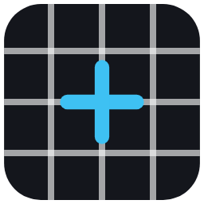
</p>

<h1 align="center">Patterns</h1>

<p align="center">
  <b>Portable Windows test-pattern suite for corporate events, shows and festivals.</b><br/>
  LED walls · video walls · blended projection · multi-screen · countdowns · branding · NDI®
</p>

---

<p align="center">
  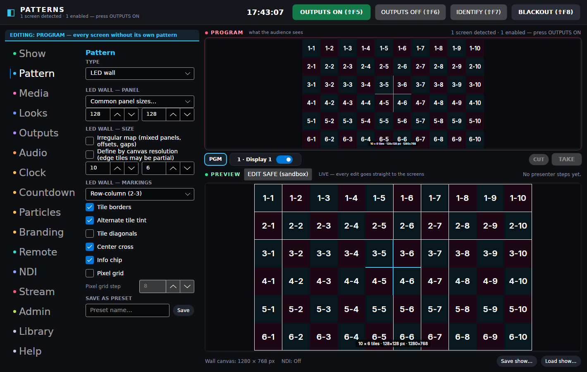
</p>

**Patterns** is a single portable `Patterns.exe` you keep on a USB stick. It opens instantly on
any Windows 10/11 x64 machine — no install, no admin rights, no registry — and puts accurate,
pixel-exact test patterns on every screen, wall and NDI receiver in the room. It is built to run
for hours without a hiccup: GPU-accelerated rendering, zero-allocation draw loops, per-frame
fault containment, and settings that can never brick startup.

## What it does

- **A graphical screen overview** — every detected screen is a live tile showing exactly what
  it outputs. Drag screens flush together and they join into one spanned canvas (seam-tested,
  viewport-exact); drag them apart and they split again. Any screen can be enabled/disabled or
  given its own pattern — and your main screen stays off by default when other outputs exist,
  so GO never covers the controls.
- **LED wall mode** — describe the wall the way LED techs do: panel pixel size (any custom size,
  presets for 64–256 px), then either columns × rows or a target canvas (edge panels go partial,
  like the real thing). Tile borders, row-column / linear / serpentine data-run numbering,
  pixel grid, center cross, dimension readouts. **Irregular walls too**: switch to the map
  editor and drag mixed-size panels, offset blocks and gaps into place (they snap flush) —
  or seed the map from the grid and edit the exceptions.
- **Video wall mode** — standard-resolution display elements (landscape or portrait), any grid,
  bezel-loss hatching, per-element numbering, diagonals and center circles.
- **Projection blend mode** — 2–12 projectors in a row or column, native resolution and overlap
  in pixels, continuous alignment grid through the zones, hue-coded projector frames, blend-curve
  ramps (linear / cosine / S-curve / gamma 2.2), zone markers with centerlines, and a flat 50%
  grey double-stack check.
- **Edge blend on the real outputs** — tick *Automatic* on two projectors and overlap them on the
  Screens page: the overlap becomes a joined canvas both draw, each output fading its shared
  edge to black along the chosen curve with a blend gamma you tune until the grey check reads
  flat. Manual widths per edge for a rig measured by hand; a keystoned projector's fade follows
  its keystone; NDI, monitors and the preview never fade.
- **A proper pattern library** — alignment grids, SMPTE RP 219-style / EBU / 75% / 100% bars
  (legal or full range), grey & RGB ramps, banding steps, focus charts (Siemens star, line pairs,
  type), geometry & safe areas, flat fields, 1-px checkerboards — parametric at any resolution up
  to 4K DCI and beyond, with a thumbnail preset gallery plus your own saved presets.
- **Motion diagnostics** — moving bar with a px-per-frame judder mode, bouncing FPS box,
  frame-flash drop detector, animated zone plate, scrolling grid.
- **Particle mini-studio** — snow, confetti, starfield, rain, bokeh, embers, fireflies presets;
  emitter, physics, shapes (including your logo as a sprite), brand palettes, additive glow —
  thousands of particles, one draw call.
- **Time, date & countdowns** — clock overlay (12/24 h, seconds, date) and a show countdown to a
  time of day or a duration (“BACK FROM LUNCH AT…”, “SHOW STARTS IN…”), with hold / flash /
  message endings and an optional progress bar. Overlays composite over *any* pattern.
- **Corporate branding** — brand kit (primary/secondary/accent/background/text + logo) that
  drives accents, checkerboards, colour cycles, particles and overlay text. Measurement lines
  stay neutral so patterns remain accurate. Kits save/load per client.
- **User media & playlists** — your images (PNG/JPEG/BMP/WebP) with fit modes; your videos
  *and audio files* (MP3/WAV/FLAC…) via libVLC (bundled in the *full* download, optional
  otherwise), with live mute and volume that never restart the media. Everything you load
  lands in the Library under *My media* for one-click recall — and the **playlist** source
  cycles files and whole folders (rescanned live): drag rows to re-order or use seeded
  shuffle, images on a dwell timer, videos/audio to their end, a ▶ NOW marker on the
  playing row, per-item overrides and daily *play at HH:mm for N seconds* scheduling.
  Media renders through the engine, so it reaches spans and NDI too.
- **Live inputs** — receive an **NDI® feed** off the network (sources auto-discovered), or an
  **HDMI/SDI capture device** (Elgato, Magewell, Blackmagic WDM, AVerMedia, webcams — anything
  DirectShow) — both composite through the engine like any pattern, so a camera or remote feed
  reaches spans, trims and NDI outputs.
- **Web pages on screens** — open a session schedule, dashboard or stream full screen (kiosk)
  or windowed on any chosen screen, as managed Edge/Chrome windows with a private profile:
  they never touch the operator's browser and close from the app with one click, with a
  saved-pages list for quick recall.
- **Looks & cues** — save the entire content state (pattern, per-screen patterns, overlays,
  countdown, blackout) as a named look on `F1`–`F12`, then run the evening from a simple
  schedule: *Walk-in 18:00 · Countdown 18:45 · Blackout 19:00*. Screen arrangement and NDI
  infrastructure deliberately stay put when a look recalls.
- **Portrait & mismatched house displays** — per-screen output rotation (90°/180°/270°,
  content stays upright, the overview shows the rotated footprint) plus per-screen
  brightness / gamma / RGB trims as exact 256-entry LUTs — match that one warm hotel plasma
  without touching the rest of the rig.
- **Soundcheck audio** — a click-free tone generator (20 Hz–20 kHz, dBFS level) and a channel
  ident (one pip LEFT, two pips RIGHT) with a matching on-screen indicator on every output,
  so front-of-house can confirm routing at a glance. Never auto-starts with the app.
- **Ticker data feeds** — point the message ticker at an RSS/Atom feed, a CSV/text file of
  lines, or an ICS calendar (next 24 h as `HH:mm Event`) — session schedules and wayfinding
  straight onto the screens, refreshed on your interval. The ticker loops seamlessly at any
  speed and text length, every screen, span half and NDI sender shows the same train, and the
  message can sit on a soft fade (the classic lower third), a solid bar, a chip or nothing.
- **System fonts** — overlay text (clock, countdown, messages, chips) in any font installed
  on the machine, with the bundled Inter as a travelling fallback.
- **NDI® outputs** — any number of senders, each with its own name, resolution, frame rate,
  source (program or a specific screen) and bit depth — including **10-bit P216** with a
  BT.709 limited-range pipeline for serious ramp/banding checks. Feature-detected at runtime
  (nothing crashes without the NDI runtime).
- **Five groups, two levels** — the rail holds **SHOW · PLAN · BUILD · SETUP · ADMIN**, grouped
  by who is at the desk and when, and the page strip across the top shows the pages of the
  current group, so eighteen pages never crowd a laptop screen. **PREP · SHOW · RUN** in the
  header is the mode: PREP holds the outputs closed while you pre-program, SHOW lets them
  open, RUN is the caller's surface — and leaving RUN is refused while the stack is armed.
  Under the wall, a **SHOW CONTROLS** drawer holds exactly four air-targeted controls —
  message, clock, countdown, audio volume — each behind an explicit **SEND** that goes to
  air whether or not the sandbox is open and is journaled as a desk action; the next look
  recall replaces it. A cue can do the same four things.
- **A Show panel** — once the rig is built, run the evening beside the switcher: every look
  as a big button, the clicker list, VOGs and stingers, the audio track and live status; the outputs
  transport lives in the header. The other pages stay out of the way.
- **Remote control** — a **web remote** (big-button page for any phone/tablet on the network),
  a one-command-per-line **TCP protocol** with live state feedback, and a ready-made
  **Bitfocus Companion module** (`integrations/companion-module-patterns/`) with presets for
  transport, looks `F1`–`F12`, individual screens and screen groups, presenter steps and
  audio — plus feedbacks and variables for Stream Deck keys. See [`docs/REMOTE.md`](docs/REMOTE.md).
- **A cue stack** — the Cues page (PLAN) holds two lists of the same kind: the **cue stack** a show
  caller runs in order, and the **clicker list** a speaker steps through. A cue is one or
  more typed actions run in order — apply a look (with its own cut or fade), play or stop the
  audio track, fire a VOG or stinger, switch a playlist part, start or stop the stream, blackout,
  screens and canvases on or off, start a countdown, a message or the clock, and hand the
  room to the other list. Numbers are labels (`03.020`, auto-assigned, editable, never used
  to sort); every reference is **checked as you build** by simulating the list in order, so a
  part named by cue 12 is checked against the playlist cue 9 puts on air. A cue that cannot
  run is marked **broken** with the reason, GO refuses it, and the rest of the list still
  runs — one deleted look never stops a show. A cue stops at its first failing action and
  says "failed at action 2 of 3"; blackout stays as it was unless the cue switches it.
- **Run mode** — press **RUN** in the header and the window becomes the show caller's
  surface: a **LIVE strip** that names what is on air (a look, `03.020 Five-minute call`,
  `VOG: …`, `STING: …`, `STING HOLD: …`, `PART: …`, or `MODIFIED — last …` after a send), the wall beside the **cue
  stack** with the last, standby and next cues marked, and a transport row — **ARM**,
  standby ▲ ▼, a big green **GO**, **HOLD**, **BLACKOUT** and a small guarded **STOP ALL**.
  Every GO passes one gate in order, whatever pressed it: armed, not held, blackout off,
  nothing executing, a cue on standby, the standby the sender saw still current, 300 ms
  since the last GO, confirmation satisfied — and a refused GO says why. A cue that asks
  for confirmation turns GO into `CONFIRM 03.020` for four seconds. While armed, the daily
  schedule, playlist part start times and plain F-keys wait (the desk's look buttons and a
  remote's LOOK stay live), so only the caller moves the picture. **Enter** is GO, ↑ ↓ move
  standby, Esc cancels a confirm and twice is STOP ALL (audio, break music, VOGs, stingers, tone —
  never the outputs, blackout or the stream). A watchdog relaunch reopens Run **disarmed** at the next
  cue with a banner, and fires nothing; the history reads from the journal. **POP OUT** puts
  the Run surface on the caller's own monitor as a second window with its own keys; the
  `/run` page on the web-remote address gives a tablet the same LIVE strip, standby, next
  six and GO / HOLD; Companion module 1.1.0 adds GO (green armed, amber on hold, red when
  the last cue failed), standby, HOLD, ARM and STOP ALL keys with feedbacks and variables;
  the protocol gains `CUE GO / STANDBY / HOLD / ARM / LIST`, `STOPALL` and `HELLO <name>`.
- **Presenter click-through** — the clicker list: hand the presenter a USB clicker,
  `Page Down` advances, `Page Up` goes back (exactly what presentation remotes send), and
  each click fires the next cue — a look, a message, a VOG, anything a cue can do. It
  answers only while armed (always off when the app opens); the remote and Companion
  `NEXT`/`PREV` drive the same list. Older shows' presenter steps move into it on load.
- **Crossfade transitions** — content changes glide instead of cut (100 ms–3 s, engine-level,
  so they work on spans, rotated outputs and NDI alike — even between videos and live inputs).
  Turn them off and everything cuts clean like a test-pattern box should.
- **Picture-in-picture** — a second live input (another NDI feed or a capture device) as a
  corner overlay over the program on every output: anchor, size, opacity and border are live,
  and the feed **crops from any side** (a slate, a border, a black bar) with the inset taking
  the cropped shape. Confidence-monitor the camera while the walls show content.
- **Independent audio track** — play a music/VO file to **any set of audio outputs**: the
  **computer's own output** (the jack or interface feeding the venue sound system — a
  pinned, explicit choice), HDMI screen audio, a Dante/USB interface — several at once,
  with loop and live volume, regardless of what's on screen. Video sound and the tone
  generator stay separate.
- **Break music from Spotify** — your playlists, albums and songs as one-press buttons for
  the room between the show's own content: walk-in, the interval, the wrap. Patterns
  *drives* Spotify rather than playing it (the sound comes out of the Spotify app on the
  desk machine or any Spotify Connect device — Spotify's DRM allows nothing else), tells it
  what to play, how loud and when to stop, and reads back what is on. It ducks under a
  VOG sound and fades under a stinger like the music track, **STOP ALL pauses it**, and it is a cue action
  (play / pause / skip / level), a `MUSIC` remote verb and a Companion key. Needs Spotify
  Premium and your own free Client ID; the feature is off until you switch it on.
- **4-corner warp** — nudge each output's corners (keystone/skew) so a slightly-off projector
  lands straight on the surface — composed with rotation and per-screen trims, applied to
  patterns, media and live inputs alike.
- **A switcher workspace** — the right side of the window works like a vision mixer:
  **PROGRAM on top** (always what the audience sees), **PREVIEW below**, and **the wall**
  between them — one tile per *content target*: the program, every joined canvas and every
  stand-alone screen, each with its **custom label**, a **PGM and a PVW miniature** (true
  pictures at the target's own shape, so a 3840×1080 wall looks like a wall) and a **tally**
  (red on air, amber held, grey off). Click a tile and the big panes take its shape and
  show it; its buttons are **OWN** (its own pattern instead of the program — a joined
  canvas can hold content of its own now), **MON** (draw the miniatures), **ARM** (the next
  CUT / TAKE changes it; un-armed, it keeps the picture the audience is seeing) and the
  live **OUTPUT** switch. A bold banner above the page always says what you're editing.
  Flip **EDIT SAFE (sandbox)** and the preview detaches from air: build the next look with
  every editor as normal, then **CUT** (instant) or **TAKE** (crossfade) it to every armed
  target, or send it to ticked tiles as their own pattern — or save it as a look, or
  discard. Blackout and OUTPUTS ON/OFF stay live through the freeze; what you *fire*
  (looks, cues, stingers, remote commands) still goes straight to air, only what you are
  editing is held back. Subtle neon hues mark every group and page, so the right page is
  one glance away.
- **Playlist show parts** — split the playlist into named parts of the show (*Walk-in ·
  Main · Break*): one part plays at a time, clicked on air from chips (or `SECTION 2`
  from the remote/Companion), or **starting daily at a set time**. Old flat playlists
  migrate into a first part untouched.
- **Streaming output** — send a chosen screen to the internet through the bundled libVLC:
  encoded **once** at your resolution/frame rate/bitrate, duplicated to **up to two
  destinations** (RTMP for YouTube/Twitch/Restream, SRT, UDP) at no extra encoding cost.
  Optional audio from a capture device; never auto-starts; an encoder or network failure
  changes a status line, never the show.
- **Customisable multiview** — a monitor wall as a pattern: program, any screen **or joined
  canvas** at its own real shape (a 3840×1080 wall is a long thin tile, a portrait screen a
  tall box), live inputs and a clock, with the same labels (your custom names) and **red
  on-air tally** the wall uses — so the multiview, the wall and the outputs never disagree;
  a target with no display attached is drawn 16:9. Being engine-rendered it goes anywhere —
  an operator screen, an NDI sender — and it's **available remotely** at `/multiview` on the
  web-remote address (live JPEG refresh).
- **VOG** (voice of God) — one-press sounds and clips over the show, no audio engineer
  needed: *"Take your seats, the show is about to begin."* A sound plays over everything on
  the audio-track outputs while the music ducks underneath (and comes back by itself) — and
  over a **playing stinger** it ducks the stinger too, sound or clip, rather than stopping it,
  so a long hit carries on under the announcement and comes back up after it; a
  **video clip takes over every screen and the previous content returns the moment it
  ends** — unless the operator changes content mid-clip, in which case their choice stands.
  Fired from the Show panel, a cue, the web remote, the TCP protocol or Companion.
- **Stingers** — transition hits from the same library: the music **fades out** instead of
  ducking, a clip **dissolves in**, and when it lands the show goes where the stinger says —
  **back** to what was on, **held** on the last frame for your TAKE or GO (with an optional
  hold limit), **on to the caller's next cue** through the real GO gate, or to **a look or
  cue you name**. Anything that cannot run puts the show back and says so; STOP ALL always
  puts a held stinger back and never runs its ending. One library and one numbering for both
  kinds, so `STINGER 3`, a saved Companion key and a cue target never change meaning; `VOG n`
  and `STING n` refuse the other kind. A crash mid-sting comes back to the show, never the clip.
  A stopped sound or clip **fades out** over the stop fade (never a cut) and is silenced for
  good — nothing told to stop can be heard again under the next press, however soon it comes.
- **A watchdog that keeps the show up** — the app runs supervised: a crash, or a UI that
  stops responding for 30 s, gets the app restarted within seconds **with the same setup —
  outputs re-opened and the audio track resumed** (a sidecar file remembers what was live;
  a clean close never auto-restores). Restarts back off and stop if something genuinely
  crash-loops. Individual render faults never get that far: they're contained per frame and
  counted on a health line (uptime · restarts · faults caught) on the Show page and remotes.
- **Every input, on its own, anywhere you want it** — live sources are a pool, not a slot:
  a camera on screen 1, the graphics PC's NDI feed on screen 2 and a walk-in video on screen 3,
  all at once, each with its own decoder. Use the same feed in several places — two screens, the
  PiP inset, a multiview tile — and it still costs **one decode**; multiview tiles can name their
  own NDI source or capture device, so a monitor wall shows four different inputs. The Media page
  lists what is mounted and says so when the rig wants more than the limit (4 decoders, 6 NDI
  receivers).
- **The preview is sandboxed by default** — from the moment the app opens, touching any editor
  (screens, outputs, inputs, patterns, overlays) builds in the preview and **never reaches the
  audience** until you CUT or TAKE — and EDIT SAFE re-arms itself after every send, so you are
  always building in safety. What you *fire* still goes straight to air: F-key looks, scheduled
  cues, presenter steps, stingers and every remote command. `→ PVW` loads a look into the preview
  instead. Turn it off in Admin → Switcher if you prefer the preview to mirror the program.
- **Prep mode — programme the show before the rig exists** — switch to PREP and build the whole
  thing at your desk with nothing plugged in: **plan screens** at the sizes the venue will have,
  arrange them, name them, give each its pattern, join them into canvases, put them in the
  multiview, and type in the NDI and capture names the rig will use. The outputs are held closed
  so nothing goes live by accident. At the venue, switch to SHOW, say which detected display each planned
  screen turned out to be and press **Adopt** — position, label, rotation, trims, warp, per-screen
  pattern, canvas name, multiview tiles and the stream source all follow onto the hardware.
- **A Machine page (ADMIN) that watches the machine** — live **CPU / memory / GPU / frame-rate**
  with three-minute history charts, and **plain-language suggestions** when something needs
  attention: running on battery, memory climbing like a leak, frames dropping, disk
  filling, handle counts growing, the show stuck on the integrated GPU. A rolling
  `patterns.metrics.csv` (30-second samples, rotated at 1 MB) records the night for
  after-show reading; a computer overview with one-click **Copy support info** feeds
  tickets; **Restart app** relaunches through the watchdog with the show restored. The
  machine numbers also ride the remote protocol (`machine{cpu,ram,fps,battery,advice}`)
  and Companion variables — CPU and fps in a Stream Deck key corner.
- **It finds your best graphics card by default** — at startup Patterns enumerates the
  GPUs (DXGI), picks the strongest (most video memory, discrete first), renders on it, and
  registers the choice in Windows' per-app graphics preference so **video decoding follows
  the same card** — on laptops this is what stops the show landing on the battery-saver
  GPU. Selectable in Admin: best performance, power saving, a specific adapter, or let
  Windows decide.

<table>
  <tr>
    <td>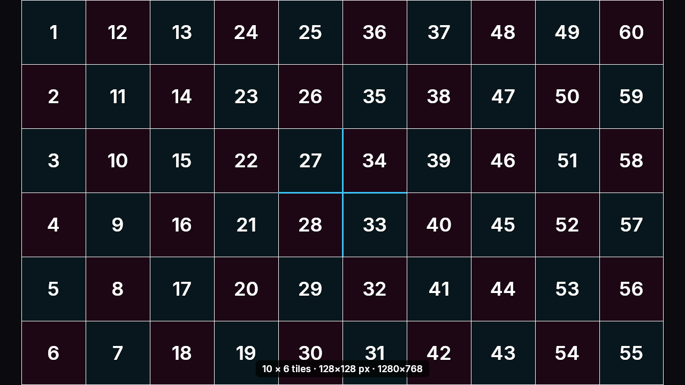</td>
    <td>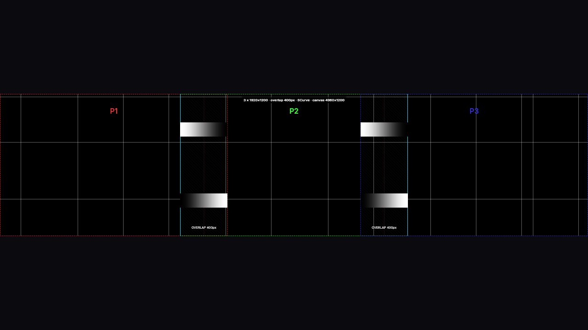</td>
  </tr>
  <tr>
    <td>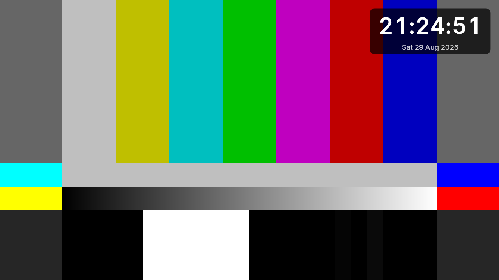</td>
    <td>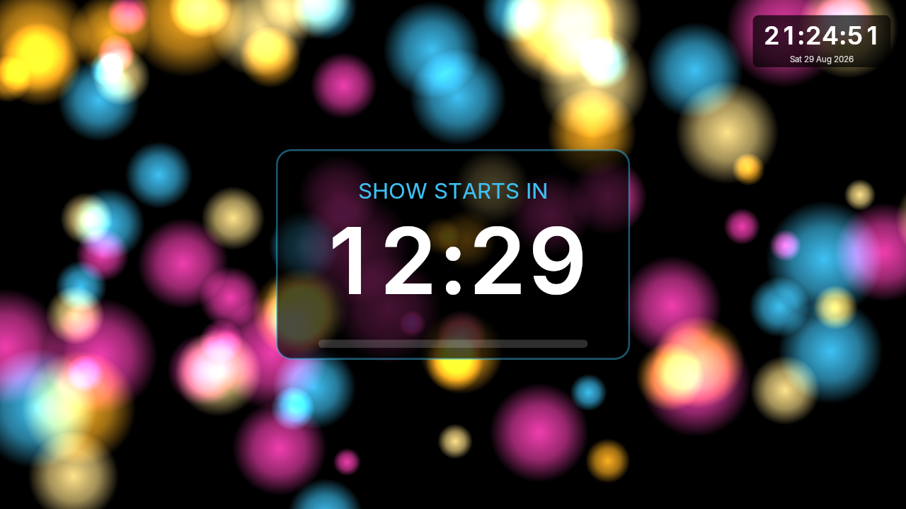</td>
  </tr>
  <tr>
    <td>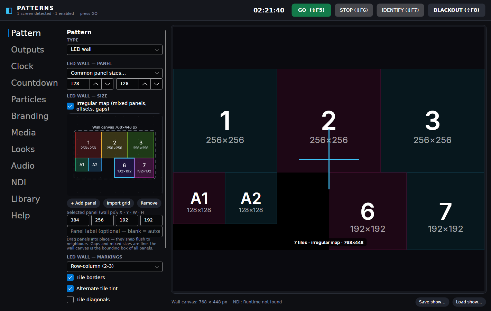</td>
    <td>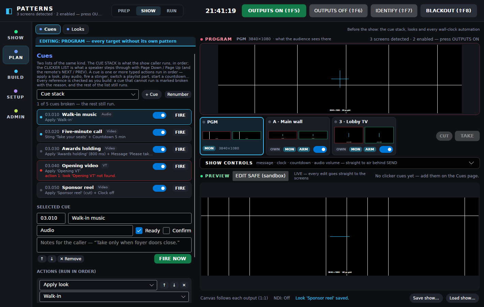</td>
  </tr>
  <tr>
    <td>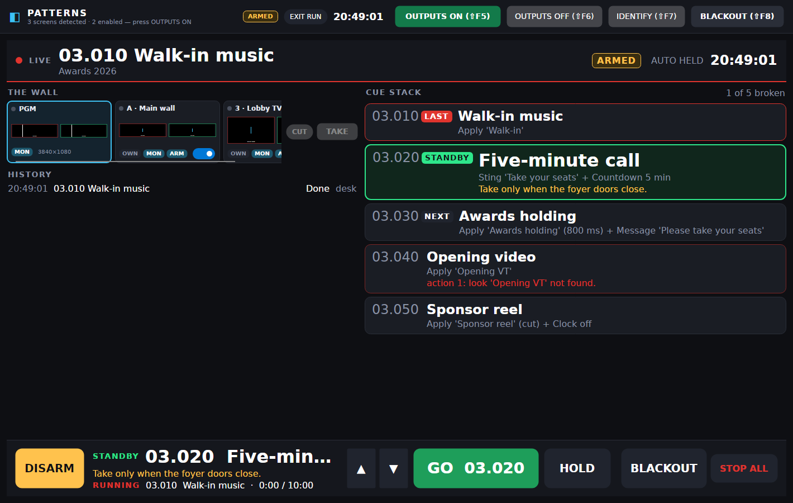</td>
    <td>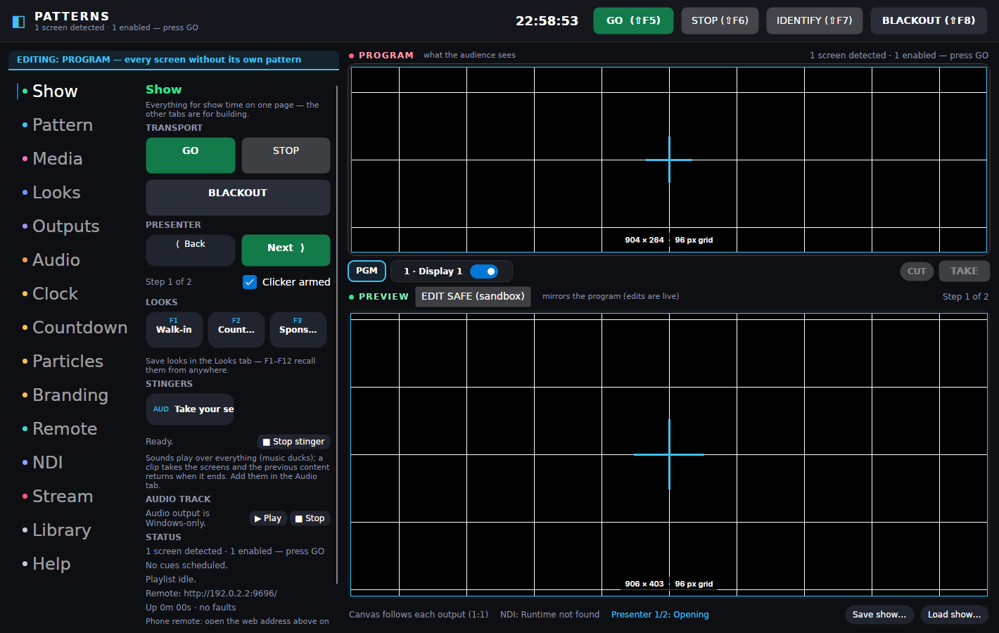</td>
  </tr>
  <tr>
    <td>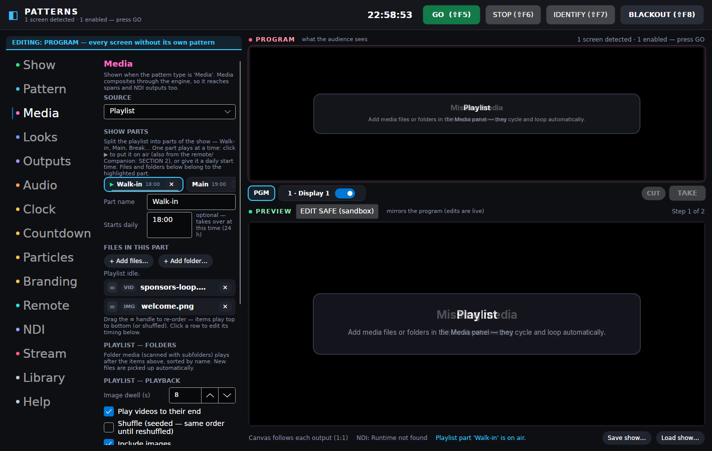</td>
  <tr>
    <td>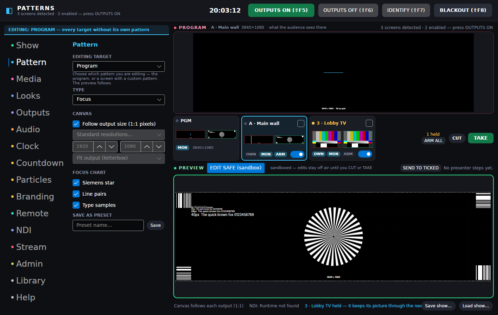</td>
    <td>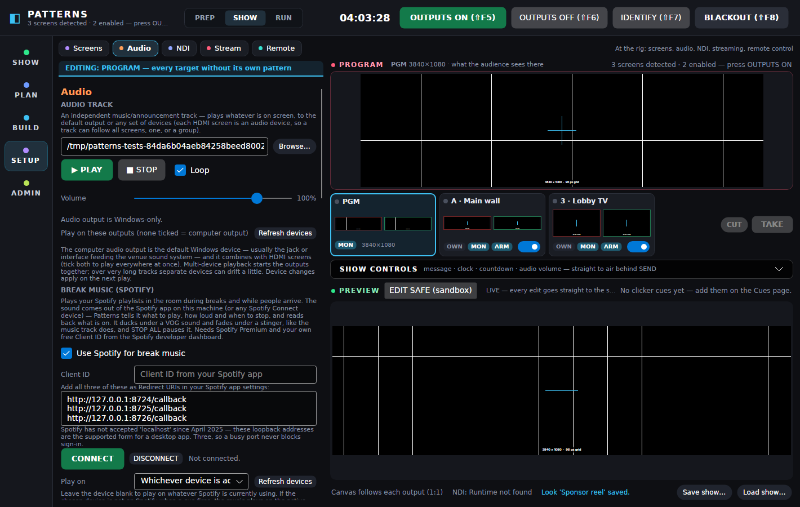</td>
  </tr>
  <tr>
    <td>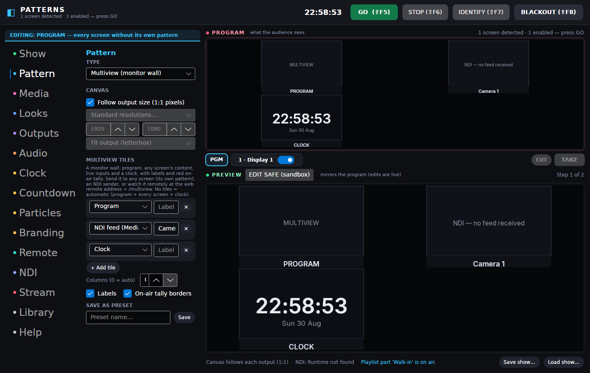</td>
    <td>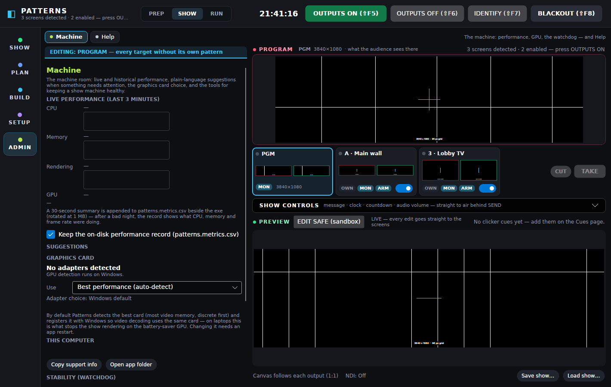</td>
  </tr>
  <tr>
    <td>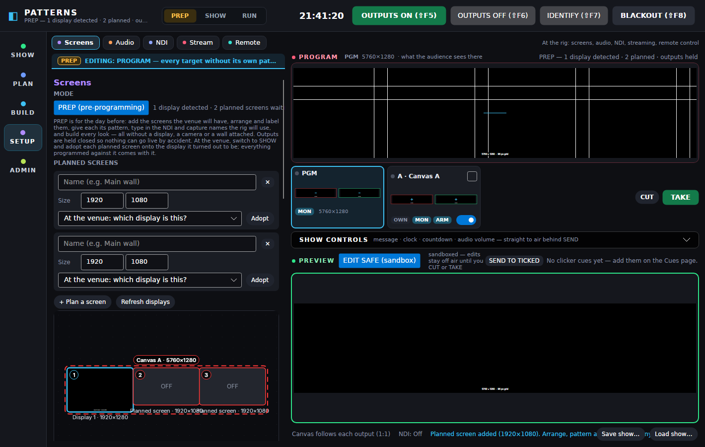</td>
    <td></td>
  </tr>
</table>

*Patterns rendered by the engine exactly as outputs and NDI receive them; the irregular-map
editor, looks/cues/presenter steps and the Show page drive them live.*

## Quick start

1. Grab `Patterns.exe` (build it with `build/publish-win-x64.cmd`, or take the CI artifact) and
   put it in a folder you can write to (USB stick, desktop — anywhere).
2. Run it. Arrange your screens on the **Screens** page (SETUP) — drag them together for one
   big canvas, click a tile to enable/disable it or give it its own pattern.
3. Choose a pattern (or click one in the **Library**), tune it, press **OUTPUTS ON** (`Shift+F5`).
4. Everything — wall geometry, blend overlap, colours, countdowns — updates live on the outputs.
5. Save the state as a **look** and put it on an F-key or the daily schedule (**Looks** page,
   PLAN); build the cue stack on the **Cues** page.
6. Run the evening from the **Show panel** or the **RUN** surface — or from a phone, tablet or
   Stream Deck via the **Remote** page (web remote, TCP protocol, Bitfocus Companion module).

| Key | Action |
|---|---|
| `F1`–`F12` | apply saved looks |
| `Shift+F5` | OUTPUTS ON — open the output windows |
| `Shift+F6` | OUTPUTS OFF — close them |
| `Shift+F7` | IDENTIFY — flash screen numbers |
| `Shift+F8` / `Space` | BLACKOUT toggle |
| `Page Down` / `Page Up` | clicker list next / back (when armed) |
| `Enter` (Run mode, armed) | GO on the cue stack |
| `↑` / `↓` (Run mode) | move standby — no output change |
| `Esc` (Run mode) | cancel a pending confirm; twice within a second = STOP ALL |
| on outputs: `Esc` twice within a second | close outputs (one Esc never blanks the room; the prompt shows on the desk) |
| on outputs: `Space` / `B`, `I`, `F1`–`F12`, `Page Down`/`Up` | blackout, identify, looks, presenter |

Settings autosave beside the exe (`patterns.settings.json`, atomic with backup); whole rigs save
as show files (`*.patshow.json`). Presets and brand kits are plain JSON folders next to the exe.
Every change to what the audience sees — a look recall, a scheduled cue, a VOG or stinger and its
revert, a playlist part, outputs on/off, blackout — is appended to `patterns.showlog.jsonl`
with the time and who caused it (desk, keyboard, clicker, a remote's address, the schedule),
so a show can be reconstructed afterwards and a caller can see what happened after a restart.
A show file saved by a newer build never quarantines an older build's settings: a setting the
older build does not know falls back to its plain default with a warning in the log.

## Optional integrations

- **NDI**: install the free [NDI runtime](https://ndi.video) *or* drop
  `Processing.NDI.Lib.x64.dll` next to `Patterns.exe`. The NDI page shows what was detected.
- **Video**: use the **full** build (`Patterns-portable-win-x64-full` CI artifact or
  `build\publish-win-x64-full.cmd`), which bundles libVLC — or with the lean exe, install
  64-bit [VLC](https://videolan.org) / place a `libvlc` folder next to `Patterns.exe`.
  Images work without any of this.
- **Remote control**: switch it on on the **Remote** page (SETUP) — the web remote and TCP protocol
  need nothing installed anywhere. For Stream Decks, load the Companion module from
  `integrations/companion-module-patterns/` (or use Companion's Generic TCP with the
  commands in [`docs/REMOTE.md`](docs/REMOTE.md)). *No password — anyone on the network can
  drive the show while it's enabled, so switch it off when you don't need it.*
- **Spotify break music**: needs a Spotify **Premium** account and your own free **Client ID**
  from the [Spotify developer dashboard](https://developer.spotify.com/dashboard) — create an
  app there and register all three redirect URIs the Audio page lists
  (`http://127.0.0.1:8724/callback`, `…:8725/…`, `…:8726/…`; Spotify no longer accepts
  `localhost`). A development-mode app allows up to five listed Premium accounts, which is
  plenty for a desk; a business can ask Spotify for more. Which sound output Spotify uses is
  chosen inside Spotify. CONNECT on the Audio page signs in through your browser; the sign-in
  is kept in `patterns.spotify.json` beside the settings file and **never travels inside a
  show file** — a show on another machine asks for its own CONNECT.

## Building

```bash
dotnet test                      # 699 tests: pixel-exact rendering, the ticker's seamless loop, the stop fade, the gain buses, edge blend, the PiP crop, arrangement math, target geometry, playlists, input pool, DSP, remote protocol, watchdog policy, VOGs and stingers (the split, the fade, every after-policy, the hold), break music (Spotify, offline through a fake transport), switcher, sandbox/air routing, prep mode + screen adoption, playlist parts, multiview pixels, stream MRLs, GPU selection, health advisor, metrics, headless UI
build/publish-win-x64.sh         # → dist/win-x64/Patterns.exe  (single file, self-contained)
build/publish-win-x64-full.sh    # → dist/win-x64-full/  (exe + bundled libVLC; any host, .cmd on Windows)
```

Requires the .NET 8 SDK. The exe is self-contained — end users need nothing installed.

## Architecture (short version)

One UI-independent render engine (`Patterns.Core`, SkiaSharp) draws every sink — the preview,
each fullscreen output, preset thumbnails and NDI frames — from immutable show-state snapshots
published on change. Output windows render at 1:1 device pixels (per-monitor-V2 DPI aware) with
antialiasing off for alignment content; spans use union-rect viewports and are covered by a
stitching test. Redraw is demand-driven: static patterns cost ~0 when idle, clocks tick once a
second, animation runs at vsync. A renderer that throws is contained to an on-screen error card —
the show keeps running. See [`docs/PLAN.md`](docs/PLAN.md) for the full design.

## License

MIT — see [LICENSE](LICENSE). Third-party components: [THIRDPARTY-NOTICES.md](THIRDPARTY-NOTICES.md).
NDI® is a registered trademark of Vizrt NDI AB.
